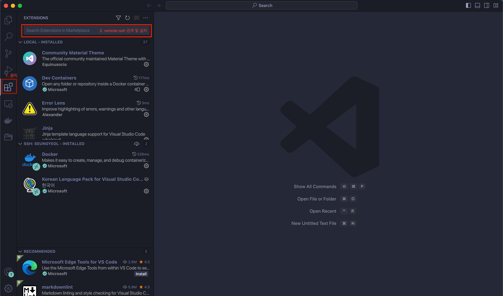
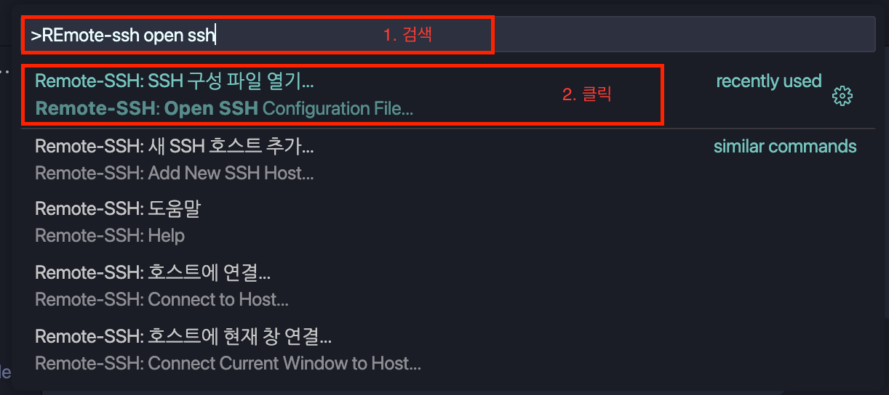
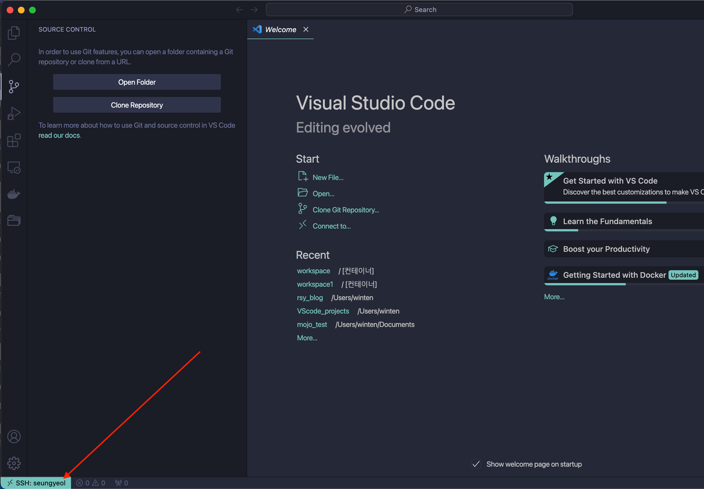
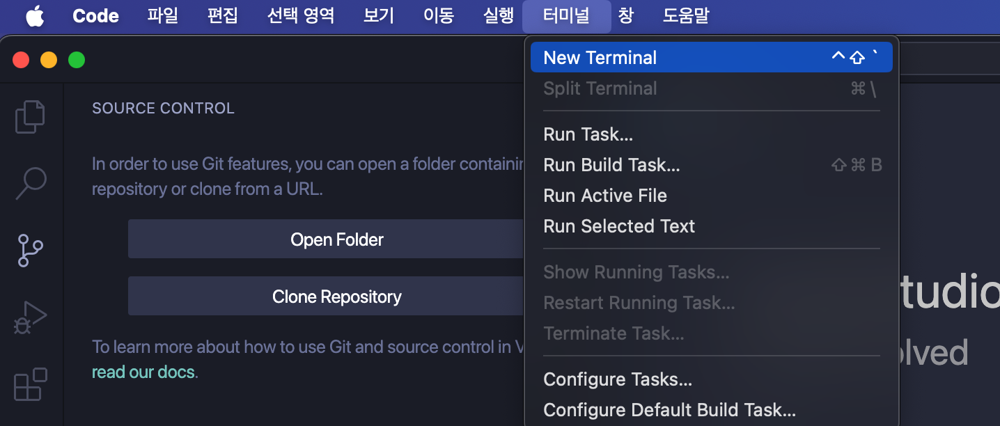
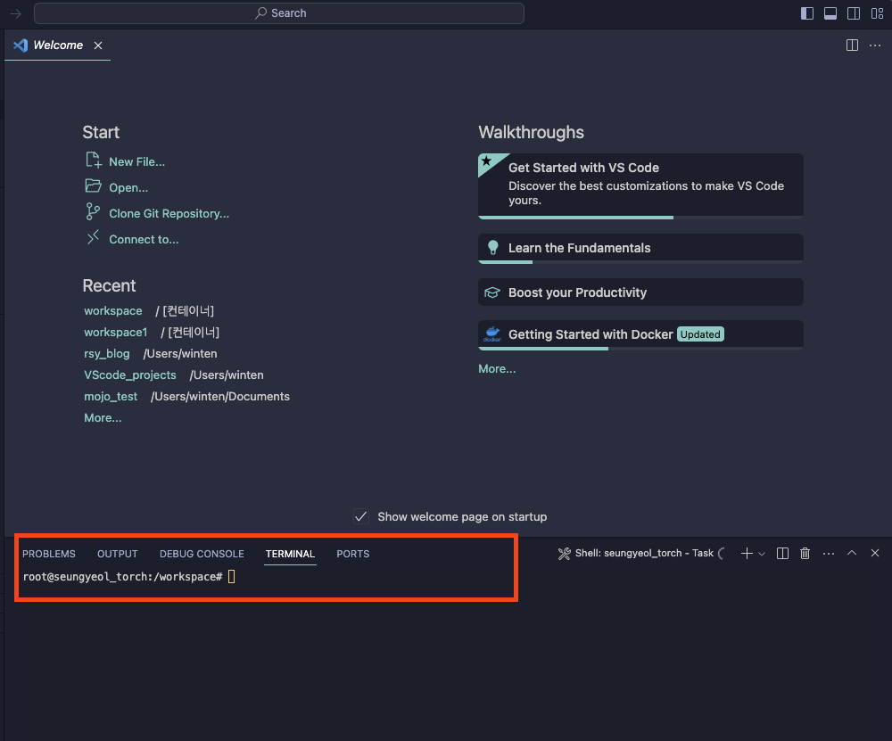
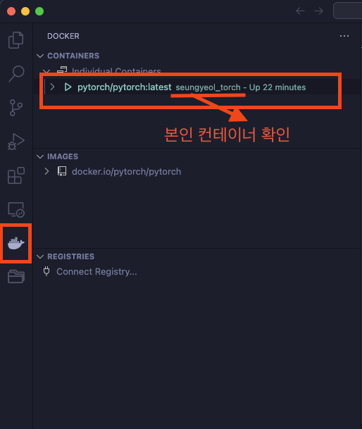
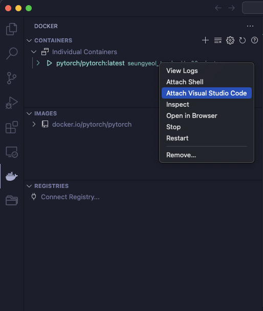
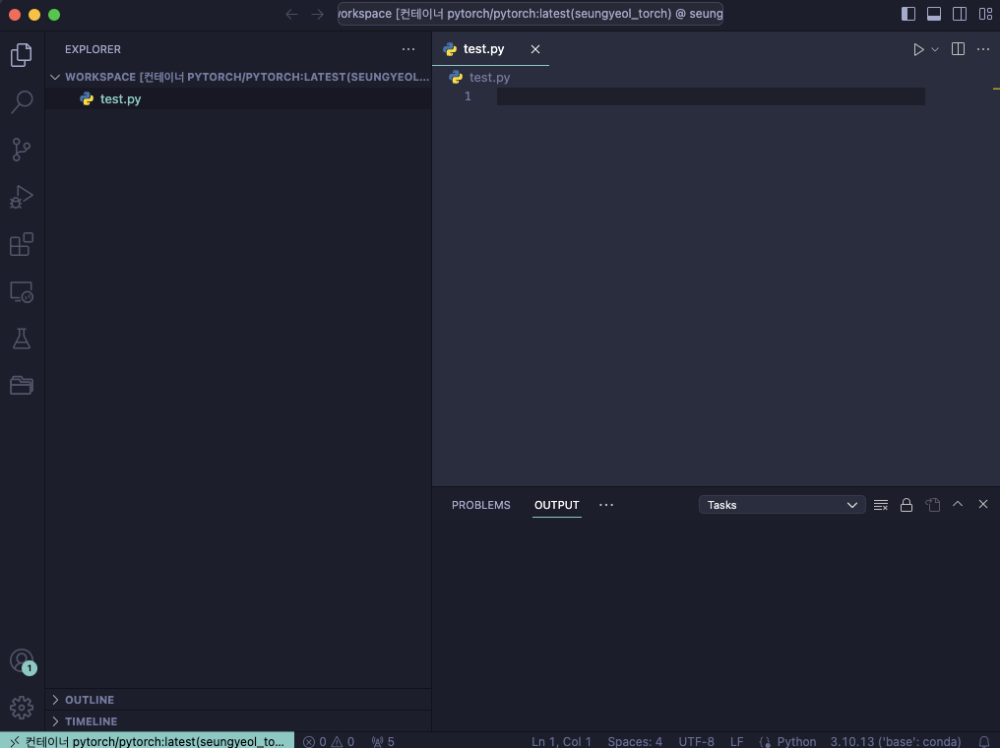

# 산업인공지능 연구실 딥러닝 서버 사용 메뉴얼

+ 작성자 : 류승열(baut3993@gmail.com)

## 서버 사용 안내

서버 사용 신청을 위해 아래와 같이 작성하여 "작성자" 이메일로 보내주시면 서버 계정 생성 해드리도록 하겠습니다.

### 예시

| USER ID   | PASSWD           | 전화번호      |
| --------- | ---------------- | ------------- |
| seungyeol | ab12cd34 (8자리) | 010-0000-0000 |

### 비고

서버에 NVIDIA GPU A5000 4개 탑재되어 있고, 교외 IP에서는 사용이 불가합니다. 기타 궁금한 사항은 작성자 이메일로 문의 바랍니다.

서버는 PyCharm이 아닌 VSCode 환경 기준으로 설명하고 있습니다. Pycharm을 기존에 사용하고 있더라도 VSCode를 설치하여 아래의 단계를 따라주시길 바랍니다. PyCharm 세팅은 다소 복잡하여 추후에 업데이트하도록 하겠습니다.

## OVERVIEW

+ 서버에 원격으로 연결하기 위해 VSCode와 VSCode 내에 존재하는 SSH 관련 확장 프로그램을 활용합니다.
  + SSH는 원격 호스트에 접속하기 위해 사용되는 보안 프로토콜로 관련한 구체적인 내용은 아래의 링크를 참고해주세요.
  + https://namu.wiki/w/Secure%20Shell
+ SSH로 자신의 계정에 원격 접속에 성공하였더라도, 이 안에서 자신만의 개발 환경을 구축하는 것은 오래 걸릴 뿐 아니라 오류가 나기라도 하면 시간 낭비로 이어질 공산이 큽니다. 따라서 Docker 를 활용하여 쉽고 빠르게 개발 환경을 구축하여 시간을 절약할 것입니다.
  + Docker는 응용 프로그램들을 프로세스 격리 기술들을 사용해 컨테이너 단위로 실행하고 관리할 수 있는 오픈 소스 프로젝트입니다.
  + 다소 생소할 수는 있지만 우리가 "가상환경을 구축하고 개발 환경을 세팅하는 과정까지"를 하나의 컨테이너 같은 곳에 담아서 관리하는 소프트웨어입니다. 우리는 누군가가 "운영체제와 가상환경 그리고 개발 환경까지 세팅해놓은" 컨테이너 이미지를 다운받아서 쓸 예정입니다.
  + 도커 그리고 도커의 기본 명령어에 대해 궁금하신 분은 아래의 링크를 참고해주세요.
  + 도커란 무엇인가? : https://aws.amazon.com/ko/docker/
  + 도커의 기본 명령어 : https://dongle94.github.io/docker/docker-basic-use/

## STEP 1 : SSH 연결

### VSCode 설치

Visual Studio code(VScode)는 Xcode, Visual Studio, Jetbrains 시리즈(Pycharm 등) 과 같이 통합 개발 환경을 갖출 수 있도록 해주는 텍스트 에디터입니다. Pycharm 과 달리 무료로 이용이 가능하며, 더 다양한 확장 프로그램(Plugins) 등이 존재하여 쉽고 편리한 개발환경을 갖출 수 있도록 해줍니다. 

VSCode 설치는 아래의 링크에서 가능합니다.

+  https://code.visualstudio.com/

### SSH 관련 확장프로그램(Extension) 설치




### CTRL + SHIFT + p (명령 팔레트) -> Remote-ssh open ssh configuration 



### C:/Users/username/.ssh/config 파일 클릭


+ 파일을 클릭하면 config 창이 열리는데

  + ```yaml
    Host [본인 이름]
    	Hostname 192.168.0.14
    	User [본인 이름]
    	Port 92
    ```

  + [본인 이름] 자리에는 본인의 User ID를 쓰는 것을 것을 권장하며 다른 부분은 건들지 말 것 !

  + CTRL + S 를 눌러 저장하고 닫기

### CTRL + SHIFT + P -> remote-ssh 호스트에 현재 창 연결 클릭


+ 자신이 처음 설정한 Passwd를 입력

### 서버 접속 완료

위의 과정을 모두 완료하였다면, SSH로 서버에 연결에 성공한 것입니다. 서버에 연결이 되었는지 확인하기 위해서는 아래의 이미지 처럼 VSCode 좌측 하단에 "SSH:server" 또는 "SSH:[본인 이름]"가 있는지 확인해보시기 바랍니다.



## STEP 2 : Docker Container 생성 및 연결

개발과 관련한 여러 Dependency 문제없도록 하기 위해 conda, virtualenv 등을 사용하는 것 대신 Docker의 컨테이너를 생성하고 연결할 것입니다. Docker Container는 우리가 직접 Dockerfile를 작성하여 생성할 수도 있지만, 지금은 이러한 Time wasting한 과정은 접어두고 누군가가 잘 만들어놓은 Docker image를 Docker Hub로부터 내려받아서 생성할 것입니다. 

아래의 링크는 Docker Hub 링크로 다양한 개발 환경에 최적화된 Image들이 올라와 있는 곳입니다. Docker Hub를 활용하여 원하는 Docker image를 내려받을 수도 있습니다. (참고로 로그인 과정이 필요합니다.)

+ https://hub.docker.com/

### 컨테이너 생성

+ 터미널을 열어줍니다. 터미널을 열면 **[본인 이름]@~** 가 뜨면서 원격 접속이 잘 된 것을 확인할 수 있습니다.



```bash
docker container run -it --gpus '"device={device number}"' 
  --ipc=host \
  --name [본인이름_컨테이너이름] \
  --hostname [본인이름_컨테이너이름] \
  -v ~/[본인이름]:/[원하는 디렉토리 이름] \
  -p 포트번호:포트번호 \
  pytorch/pytorch:latest /bin/bash
```

+ 위와 같은 명령어를 터미널에 입력하여 컨테이너를 생성할 수 있습니다. 
  + -p 는 포트번호로 개별 할당될 예정입니다.
  + pytorch/pytorch:latest 에 해당하는 부분은 docker hub에 올라와 있는 image입니다. Docker hub에 올라와 있는 다양한 이미지를 컨테이너로 만들어서 사용이 가능하며, docker hub에서 자유롭게 검색하여 수정해도 무방합니다.
  + latest는 버전에 해당하는 부분이므로 docker hub를 참고해주시기 바랍니다.
+ 아래는 docker container 생성에 관련한 예시 명령어 입니다.

```bash
docker container run -it --gpus '"device=0"'
	--ipc=host --name seungyeol_torch
	--hostname seungyeol_torch -v ~/seungyeol:/workspace
	-p 8888:포트번호 tensorflow/tensorflow:latest /bin/bash
```

### 컨테이너 연결

+ 위와 같이 명령어를 입력하면 아래의 사진과 같이 터미널이 [본인이름]@~ 에서 root@[본인 컨테이너 이름] 으로 바뀌게 됩니다.

 

+ 위와 같이 연결이 되었다면 docker를 활용한 개발환경 세팅이 완료된 것입니다. 가상환경, CUDA Tool kit, CUDNN 등을 설치가 모두 완료된 것입니다. 이제 터미널 환경을 이용하여 원하는 파이썬 패키지를 추가로 설치해도 container 내에 격리된 공간에 설치가 되는 것이므로 dependency로 고생하거나 벽돌이 되는 일을 걱정하지 않아도 됩니다.

### 개발 시작

이제 개발을 시작하면 됩니다. 그러나 터미널 환경에서 무언가를 하기에는 docker의 명령어가 익숙치 않으므로 VSCode의 Docker Extension을 설치하여 GUI 환경에서 container를 관리하도록 합니다.

+ 아래의 그림과 같이 docker extension을 설치합니다. 설치하게 되면 좌측에 도커 아이콘이 생성됩니다.


+  docker icon을 클릭하면 아래의 그림과 같이 우리의 도커 이미지와 컨테이너의 목록을 볼 수 있고, 본인이 생성한 컨테이너도 확인할 수 있습니다.

  + 여기서 docker image와 docker container의 차이가 무엇인가요? 비약적인 비유일 수 있지만 image는 "프로그램"이고, container는 프로그램이 실행된 "프로세스" 라고 이해하면 편할겁니다. 구체적인 내용은 생략하겠습니다.

  

+ 아래의 그림과 같이 오른쪽 마우스로 container를 선택하고 "Attach visual studio code"를 선택합니다. 그리고 [본인의 컨테이너 이름]을 선택합니다.




+ 그러면 VSCode의 새창이 열리면서 도커 환경에서 개발이 가능해집니다.



## 마무리

이제 원격 서버 세팅이 완료되었습니다. 유의 사항은 docker를 활용하여 container를 생성하고 접속한 뒤, 새로운 패키지를 설치하면 container를 나갔을 때, 저장이 되지 않습니다. 따라서 아래 명령어를 입력하여 container id를 확인하고, 본인 container id로 docker commit하여 새로운 image를 만들어주시기 바랍니다.

``` bash
docker ps -a 
```

```bash
docker commit [containerID] [image_name]:[tag]
```

